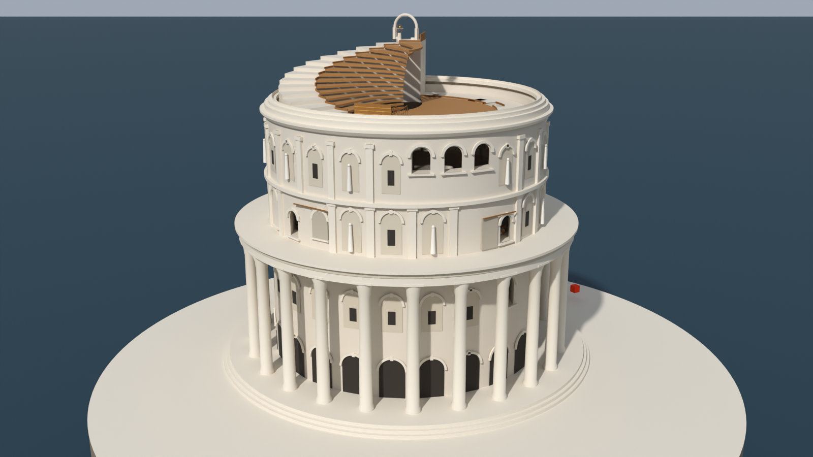
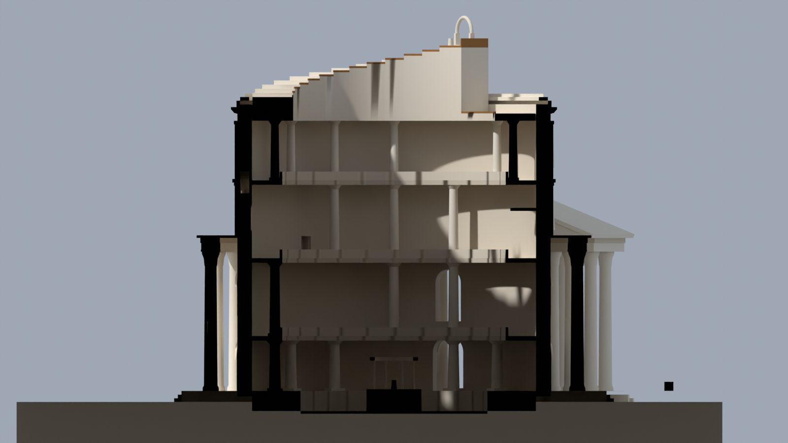
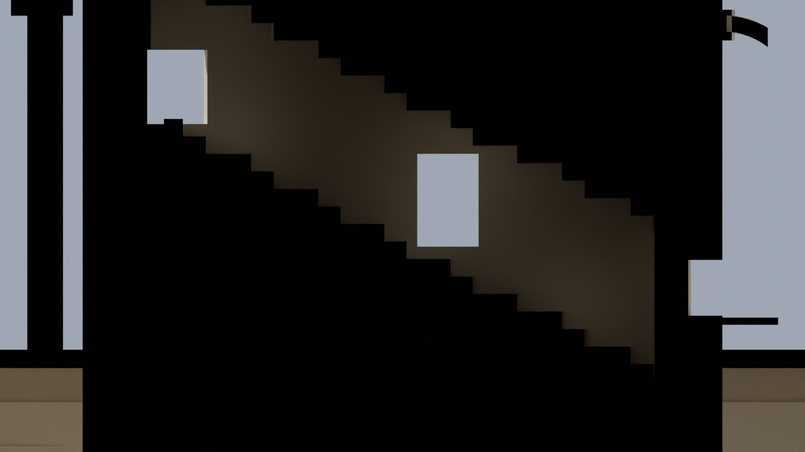
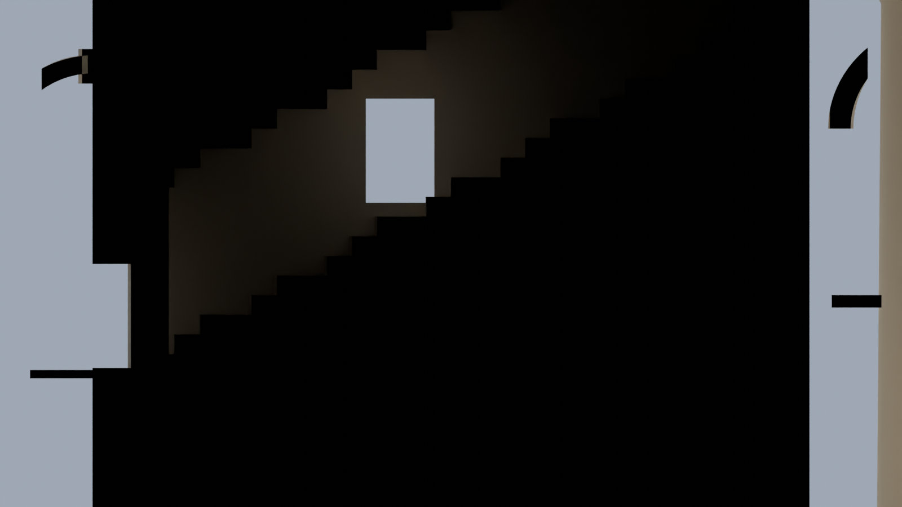
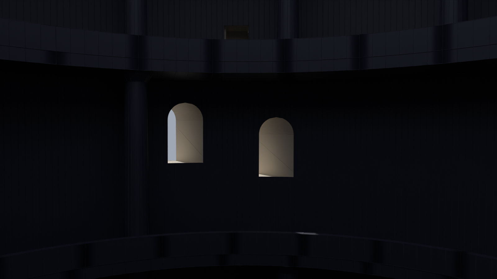
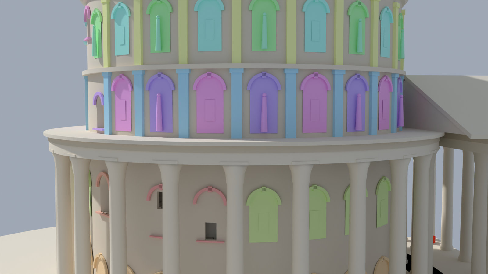

# 日落回廊 v0.12 · 建筑模型（Blender / UE）

按 v0.12 灰盒和[施工图](../../docs/施工图-v0.12.html)建的神殿建筑：墙体（含墙里的两段楼梯）、各层楼板、栏杆、内圈柱子、外立面、台基和外圈柱廊、门廊、小岛、水亭、屋顶环道、屋顶细桥、虹门。**机关还没搭**（光圈叶片、镜子、滑窗、拉杆、月石、水面、海面、浑天仪这些都不在里面）。

| 文件 | 用途 |
|---|---|
| `Dysis_Temple_v0_12.blend` | Blender 模型（4.2 做的，单位米），可以直接改 |
| `Dysis_Temple_v0_12.fbx` | 给 UE 的建筑 FBX（带着开好的洞、三角化；不含外立面的一件件构件） |
| `Dysis_Facade_Kit_v0_12.fbx` | 外立面构件库：21 种构件，每种一个网格，放在原点、正面朝外（UE 里一种一个资源） |
| `Dysis_Facade_Placed_v0_12.fbx` | 外立面 158 件已经摆在原位的版本（只在不跑脚本、手动导入时用） |
| `ue_import_temple.py` | UE 里跑的脚本：导入、按施工图摆好（外立面按构件库一件件摆）、核对数值 |
| `核对报告.md` | 模型上量出来的数值和设计值的对比（Blender 143/143，UE 脚本 244/244） |
| `preview/` | 预览图：鸟瞰、剖面、两段墙里楼梯的剖面、殿里看窗、外立面构件按种类上色 |
| `tools/` | 生成这些文件用的脚本（见最后） |

## 坐标

| | 北 | 东 | 上 | 单位 |
|---|---|---|---|---|
| 施工图 | 方位角 az 0°（顺时针） | az 90° | y | 米 |
| Blender | +Y（顶视图里北朝上） | +X | +Z | 米 |
| UE | +X | +Y | +Z | 厘米 |

施工图上 (az, r, y) 的点：Blender 里是 (r·sin az, r·cos az, y)，UE 里是 X = 100·r·cos az，Y = 100·r·sin az，Z = 100·y。殿心在原点，一层（水庭）地面 y = 0。

## Blender 里怎么改

集合按类别分好，每个构件是单独的物体，轴心放在构件底部（绕殿心一圈的楼板、栏杆、外立面、台基的轴心在殿心）：

| 集合 | 内容 |
|---|---|
| 01 墙体（含墙里楼梯） | `SM_Wall`：一整圈墙（内半径 15.5、外半径 17.1，墙底 −0.6、墙顶 31.3），带一个布尔修改器开洞 |
| 01b 切割体（改窗洞门洞楼梯） | 20 个切割体（默认隐藏，点眼睛图标显示）：8 个主光窗、北门、海窗（`CUT_窗_*`），两段楼梯的空腔（`CUT_楼梯_TS/TR`），4 个楼梯门，5 个楼梯朝外的小窗 |
| 02 楼板与台面 | `SM_Floor_L0~L3`、池底、水闸石台、日之龛石台、瀑布后石沿、接缝石块、瀑布顶的铜沿 |
| 03 栏杆 | `SM_Parapet_L1~L3` |
| 04 内圈柱子 | `SM_Col_L楼层_方位角`，比如 `SM_Col_L1_030` 是二层 30° 那根，一共 28 根 |
| 05 外立面 | 一件一个物体，分 5 个子集合：05a 盲拱（86 间）、05b 壁柱（43 根）、05c 主光窗窗框和北门门框（9 个）、05d 雕像（20 尊）、05e 檐口和线脚（整圈 3 道）。见下面“外立面” |
| 06 场地·台基·柱廊·门廊·小岛 | 台地、台基、外圈柱廊 24 根（`SM_PeriCol_方位角`）、柱廊檐口、门廊柱 10 根、门廊屋顶和台阶、小岛 |
| 07 水亭 | `SM_Pavilion` |
| 08 屋顶环道（每一块单独，升降用） | 白天升起以后的样子：`SM_Roof_Up01~16`（上行 16 级，16 是最高平台）、`SM_Roof_Dn01~16`（夜里降下去的 16 级，白天在环道上）、`SM_Roof_Land`（细桥落脚）、`SM_Roof_Fix01~05`（固定段）等 |
| 09 屋顶细桥 / 10 虹门 | `SM_RoofBridge`、`SM_RainbowArch` |
| 99 方位标记（核对用，可删） | 三块 1 m 的红方块：北 30 m、东 30 m、殿心正上方 45 m。UE 脚本靠它们认朝向 |

**改窗洞、门洞、楼梯**：显示 `01b` 集合，选中对应的切割体移动、缩放或者进编辑模式改点，墙会马上跟着变（布尔修改器没有应用）。比如 `CUT_窗_c` 往上挪 0.5 m，c 窗的窗台就从 17.56 变成 18.06。楼梯空腔 `CUT_楼梯_TS/TR` 是一整块台阶形的管子（每 1.25° 一级，净高 2.4 m），踏面和踢面是深色石材质，开洞以后自动带到墙上。

**外立面**：每一件（一间盲拱、一根壁柱、一尊雕像、一个窗框）是单独的物体。
- **轴心**：在构件底部贴外墙的那一点，正面朝外（物体的 −Y 朝外，和 Blender 前视图看到的正面一致）。
- **旋转**：只绕 Z 转。挪、转、缩放都按这一件自己来。
- **命名**：`SM_Facade_类型_L层_编号`。比如 `SM_Facade_BlindArchWin_L1_05` 是二层第 5 间带小窗的盲拱，`SM_Facade_Pilaster_L2_05` 是三层第 5 根壁柱，`SM_Facade_Statue_L3_03` 是四层第 3 间的雕像。
  - 盲拱、雕像的编号 k：在方位角 7.5 + 15k 度那一间。
  - 壁柱的编号 k：在方位角 15k 度。
  - 每个物体的自定义属性里写着类型、方位角、底高、所在层。
- **共用网格**：一模一样的构件共用一份网格，一共 21 种，名字是 `SM_Kit_Facade_…`，比如二层带小窗的盲拱 19 间都用 `SM_Kit_Facade_BlindArchWin_L1`。
  - **整批改**：进编辑模式改其中一件，同一种的全部跟着变。
  - **整批换**：在“物体数据”里把网格换成做好的新网格。
  - **只换某一件**：先在“物体数据”里点用户数那个数字，把它设成单独用户，再改或换。
  - 新做的构件按同样的约定建：轴心在底部贴墙处、正面朝 −Y，换上去就在原位。

**网格**：墙的底模是 1440 个四边面的整圈墙，开完洞是 3352 个面的封闭实体。其余构件是灰盒几何清理过的：重合的顶点焊好、三角面并成了四边面（整体 87% 是四边面）。一共 287 个构件（外立面 158 件），约 9 万个三角面。

**材质**：一套 12 个（`M_stone` 墙石、`M_stoneDark` 楼梯踏步、`M_floor` 楼板、`M_column` 柱子、`M_ext` 外墙、`M_bronze` 青铜……），只有底色，给贴图时直接换。

**重新导出 FBX**：文件 → 导出 → FBX，设置：
- 勾“选定的物体”，物体类型只要“网格”，“应用单位”勾上；
- 前向 −Z、向上 Y（默认）；
- 几何数据里勾“应用修改器”和“三角化面”。

选哪些物体：
- **建筑 FBX**：除了切割体和外立面单件以外的物体。
- **构件库 FBX**：每种构件网格放一个在原点、不转，导出；`tools/build_blend2.py` 里有现成的做法。

## 放进 UE

### 用脚本（推荐）

1. 编辑 → 插件，打开 **Python Editor Script Plugin**，重启编辑器。
2. 新建一个空关卡。打开 `ue_import_temple.py`，把最上面的 `FBX = r"C:/Dysis/Dysis_Temple_v0_12.fbx"` 改成 FBX 实际放的位置（`Dysis_Facade_Kit_v0_12.fbx` 放在同一个文件夹）。
3. 工具 → 执行 Python 脚本…，选 `ue_import_temple.py`。
4. 看输出日志。最后一行是“全部通过”就对了；完整报告存在 `项目/Saved/Dysis_Temple_v0_12_UE核对.txt`。

脚本导入两个 FBX 到 `/Game/Dysis/Temple_v0_12`：
- 建筑：每个构件一个静态网格；
- 外立面构件库：每种构件一个静态网格。

碰撞设成“复杂碰撞当简单碰撞用”，人能在楼板、楼梯上走。

然后把全部 290 个 Actor 摆进关卡，大纲视图在 `Dysis_Temple_v0_12` 文件夹下，按集合分子文件夹：
- **建筑构件**：轴心在殿心，Actor 位置都是 (0,0,0)。
- **外立面 158 件**：各自一个 Actor，用构件库的网格，轴心在构件底部贴墙处、正面朝外。
  - 换一件：把这个 Actor 的静态网格换掉。
  - 整批换：在内容浏览器里对构件库资源用“替换引用”。

朝向和坐标：脚本用三块红色方位标记认出导入后的朝向和坐标换算，把整座建筑转到 +X 朝北、+Y 朝东。

最后在 UE 里再量一遍：
- 比例、朝向、标记的位置；
- 每个建筑构件的包围盒；
- 每种构件网格的大小；
- 外立面每件的位置和朝向；
- 188 条竖直射线：各层地面、楼板底、栏杆顶、窗台、拱顶、两段楼梯的每一级、屋顶环道、细桥；
- 外立面 152 件：从外面水平打到它正面的距离。

再跑一次会先清掉上次摆的。

### 手动导入（脚本跑不了时）

1. 内容浏览器里导入 `Dysis_Temple_v0_12.fbx` 和 `Dysis_Facade_Placed_v0_12.fbx`，导入选项：
   - **取消** Combine Meshes；
   - **取消** Auto Generate Collision；
   - **勾上** Transform Vertex to Absolute（默认就是勾的）；
   - Import Uniform Scale = 1。

   手动导入的外立面每件都是单独的网格、轴心在殿心，换起来不如脚本摆的方便。
2. 把导入的全部静态网格拖进关卡，位置都设 (0, 0, 0)。
3. 看 `SM_MARK_N_0deg_r30`：它应该在 X = 3000、Y = 0。Blender 默认设置导出的 FBX 导进来，它一般在 Y = −3000，这时把全部构件的旋转 Z（Yaw）设成 90 就对了。再看 `SM_MARK_E_90deg_r30` 要在 Y = 3000。
4. 每个静态网格：碰撞复杂度设成 Use Complex Collision As Simple。

UE 里建筑构件的轴心都在殿心（导入时把位置烘进了顶点，这样最稳），外立面构件用的是自己的轴心。要单独做动画的（比如屋顶的升降踏步），在 UE 里可以用建模工具改轴心，也可以照外立面的做法从 Blender 单独导出。

## 数值核对

见 [核对报告.md](核对报告.md)。Blender 里 143 项全过。UE 脚本在模拟环境里 244 项全过：模拟环境直接读 FBX 文件，按 UE 的导入规则换算坐标。真 UE 编辑器我这边跑不了，请在 UE 里执行一次脚本，确认最后一行是“全部通过”。

## tools/

- `build_blend2.py`：从灰盒导出的 `temple.glb`（灰盒 dump 版导出，外立面每件带着类型和摆放信息；文件大、没放进仓库）和 `data.json`（灰盒导出的尺寸、洞口、楼梯每一片踏步）建模型，量数值，存 .blend，导出 FBX，写 UE 期望值。`python3 build_blend2.py temple.glb data.json 输出目录`（需要 `pip install bpy`）。
- `ue_template.py` + `gen_ue.py`：生成 `ue_import_temple.py`（把期望值写进去）。
- `mock_ue_test.py`：没有 UE 的时候，用假的 `unreal` 模块把 UE 脚本跑一遍（网格从 FBX 读）。
- `gen_report.py`：生成核对报告。`render2.py`：渲染预览图。
